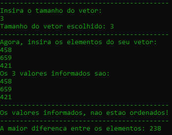

<h1>Individual Textual Production - Algorithms and programming 2</h1>

Link - https://www.youtube.com/watch?v=I0xXF1w8CLI

<h2>Theme - Working with Vectors</h2>
<h2>Base text:</h2>
A vector is a data structure that stores a sequence of elements, all of the same type, in consecutive locations in the computer's RAM memory. This structure allows random access through a numerical index, that is, any element of the vector can be reached directly, without going through the previous elements.
<h2>Statement:</h2>
Write a Java program that reads a sequence N of integers (negative, positive and zero) into a vector. At the beginning of the program, the user is asked (via the keyboard) how many elements will be read into the vector and after that the numbers are read into the vector. Then you must implement a function for each of the items below:  a) Calculate and return the value of the greatest difference between two distinct elements in the array.  b) Checks if the array is in ascending order, and returns true if it is and false otherwise.
<h2 align="center">Autor</h2>

